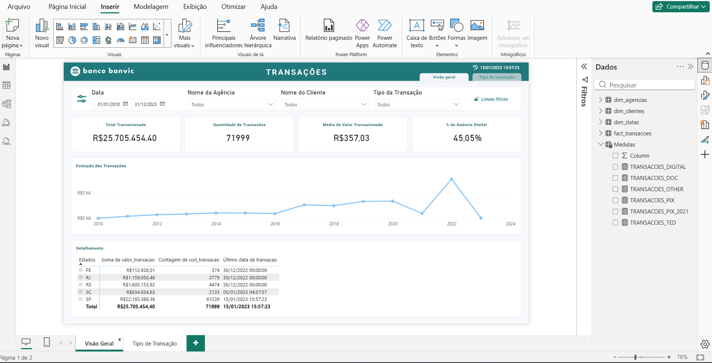
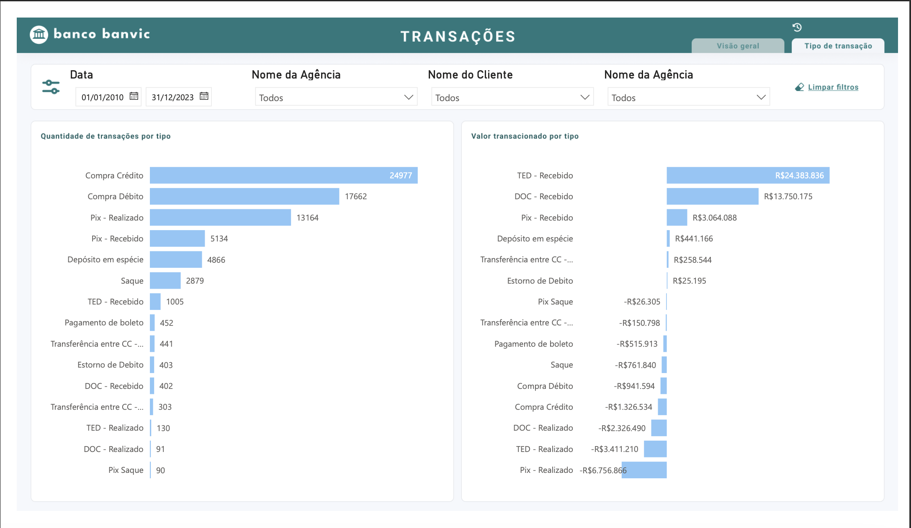

# Banvic Analytics Engineering Project

Projeto desenvolvido durante a **Formação em Engenharia de Analytics da Indicium Academy** com o objetivo de estruturar um fluxo de dados completo, desde a transformação e modelagem até o consumo em dashboards.

## Objetivo

Construir um pipeline analítico utilizando **dbt e Databricks**, organizando os dados em camadas analíticas e disponibilizando-os para análise em um dashboard no Power BI.

## Arquitetura do Projeto

O fluxo de dados foi estruturado da seguinte forma:

Dados brutos (seeds)  
↓  
Transformação e modelagem com **dbt**  
↓  
Organização em camadas analíticas  
- staging  
- intermediate  
- marts  
↓  
Consumo em **Power BI**

## Tecnologias utilizadas

- dbt
- Databricks
- SQL
- Power BI
- GitHub

## Estrutura do projeto dbt

O projeto segue boas práticas de modelagem analítica com separação em camadas:

models/
- staging
- intermediate
- marts

Essa organização facilita manutenção, reutilização de modelos e clareza no fluxo de transformação dos dados.

## Dashboard

O dashboard foi desenvolvido no **Power BI** para explorar métricas de transações do banco Banvic, incluindo:

- valor total transacionado
- evolução temporal das transações
- análise por estado
- análise por tipo de transação







## Como executar o projeto

1. Clonar o repositório
2. Instalar dependências do dbt
3. Carregar os dados seeds

```bash
dbt seed

